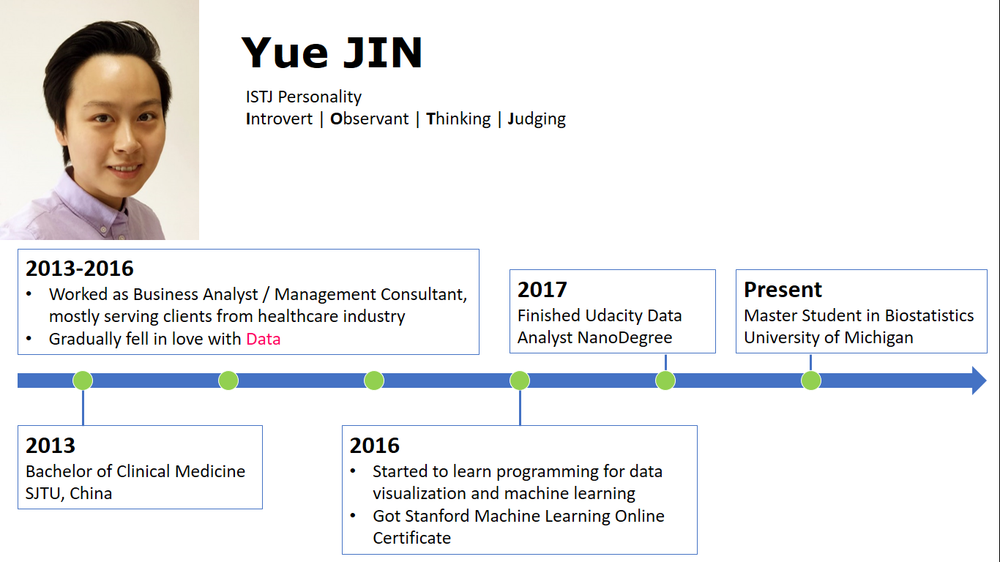
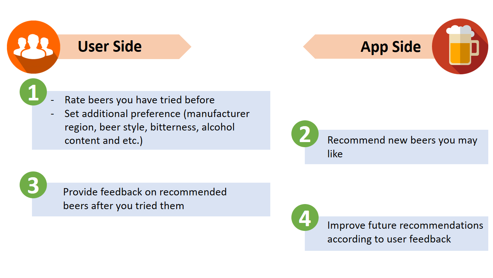

```{r setup, include=FALSE}
knitr::opts_chunk$set(echo = FALSE,warning = FALSE)
require(ggplot2)
require(dplyr)
```


### 1. About Me:




------


top rated data cleaning python script

------


### 2. Project Summary:

Build a beer recommendation App for craft beer lover leveraging open data scraped from [BeerAdvocate.com](https://www.beeradvocate.com/).



------


### 3. Motivation: 

**A Hobby for me:**

- Personally, I love craft beer

- From 2016 to Present, I tasted **152** different beers


**Market Opportunity:**

- Huge user base: 4.71M monthly users of BeerAdvocate.com, 2.99M monthly users of Ratebeer.com, 3.07M monthly users of Untappd.com [(source)](https://craftbeerinsandiego.com/blog/ratebeerisdeadlongliveuntappd)

- Business model successed in similar field: Recommendation Algorithm + Product Merchandise for wine - [BrightCellar](https://www.brightcellars.com/) 

------


### 4. Dataset Description

The data was scraped from [BeerAdvocate.com](https://www.beeradvocate.com/) via Python package [BeautifulSoup](https://www.crummy.com/software/BeautifulSoup/).

The full dataset includes:

- **104** Beer Styles

- **13K** Breweries from around the world

- **200K** Beer items

- **7 Million+** Ratings from **300K+** Users

Estimated data size is ~3 GB. 

*Detail data scraping source code can be found on my github [here](https://github.com/yjin910517/data_incubator/blob/master/data_scraping_cleaning/data_scraping.ipynb)*


------


### 5. Algorithm Test Run:


#### 5.1 Data Subset:

I subsetted the dataset by following criteria to perform an algorithm test run:

- Users who submitted >100 ratings & Beers with >1000 ratings

- **2.2 Million** ratings from **9000 Users** on **1300 Beers**

*Data cleaning code can be found [here](https://github.com/yjin910517/data_incubator/blob/master/data_scraping_cleaning/top_rated/data_cleaning.ipynb)*

\


#### 5.2 Descriptive Data Analysis:


```{r eda1}
beer<-read.csv("data_scraping_cleaning/top_rated/summary_by_beer_combined.csv")
by_style<-beer %>% group_by(style_name) %>% summarise("n"=n(),"sub_cat"=sub_cat[1]) %>% arrange(desc(n))
by_style<-by_style[1:15,]

p1<-ggplot(data=by_style,aes(x=reorder(style_name,-n),y=n,fill=sub_cat))+
  geom_bar(stat="identity")+
  theme(axis.text.x = element_text(angle = 75, hjust = 1))
p1<-p1+xlab("Beer Style")+ylab("# of Beers")
p1<-p1+labs(fill="Style Category")
p1<-p1+ggtitle("Top 15 styles among Most Rated Beers")+theme(plot.title = element_text(hjust = 0.5))
p1

```
 

```{r eda2}
company<-read.csv("data_scraping_cleaning/top_rated/summary_by_company.csv")
by_region<-company %>% group_by(region) %>% summarise("n"=sum(n_selected_beers)) %>% arrange(desc(n))
by_region<-by_region[1:15,]
by_region$is_usa<-sapply(by_region$region,substr,1,3)
by_region[by_region$is_usa!="USA",]$is_usa<-"Non-USA"

p2<-ggplot(data=by_region,aes(x=reorder(region,-n),y=n,fill=is_usa))+
  geom_bar(stat="identity")+
  theme(axis.text.x = element_text(angle = 75, hjust = 1))
p2<-p2+xlab("Region")+ylab("# of Beers")
p2<-p2+labs(fill="")
p2<-p2+ggtitle("Top 15 Manufacture Region among Most Rated Beers")+theme(plot.title = element_text(hjust = 0.5))
p2
```
```{r eda3}
by_ava<-beer %>% group_by(availabilities) %>% summarise("n"=n()) %>%
  arrange(desc(n))

by_ava[by_ava$availabilities=="",]$availabilities="N/A"

p3<-ggplot(data=by_ava,aes(x=reorder(availabilities,-n),y=n))+
  geom_bar(stat="identity",fill="steelblue")+
  theme(axis.text.x = element_text(angle = 75, hjust = 1))
p3<-p3+xlab("Availability Type")+ylab("# of Beers")
p3<-p3+ggtitle("Availability of Most Rated Beers")+theme(plot.title = element_text(hjust = 0.5))
p3
```

```{r eda4}
p4<-ggplot(data=beer,aes(scores))+geom_histogram(binwidth = 0.2,color="white",fill="steelblue")
p4<-p4+xlab("BA Score (1.0-5.0)")+ylab("# of Beers")
p4<-p4+ggtitle("BA Score Histogram of Most Rated Beers")+theme(plot.title = element_text(hjust = 0.5))
p4
```


#### 5.3 Result: 

SVD matrix factorization implemented with Python [Surprise package](http://surprise.readthedocs.io/en/stable/index.html). 

*My Python code can be found [here](https://github.com/yjin910517/data_incubator/blob/master/surprise_basic_model.ipynb)*


RMSE(Root Mean Square Error) for a 5-fold cross validation is **0.37**, MAE(Mean Absolute Error) is **0.27**, which can be considered as a good performance under the beer rating scale of 5.


**The performance can be further improved from multiple aspects:**
 
- Parameter tuning for current algorithm

- Leverage text features extracted from textual comments

- Incorporate popularity based/content based algorithms
  
------ 


### 6. Additional functions:


On top of the core functions described above, following functions can be added:

- Beer food pairing recommendation
    
- Link with purchase (price comparison and etc.)
    

Potential Dataset expansion:

- [Untappd.com](https://untappd.com/)
 
- [Ratebeer.com](https://www.ratebeer.com/)
  
------


### 7. Potential challenges:

**(AKA why I need the help from Data Incubator)**


- Handle and store big datasets
 
- Real time data source update

- User interface design


